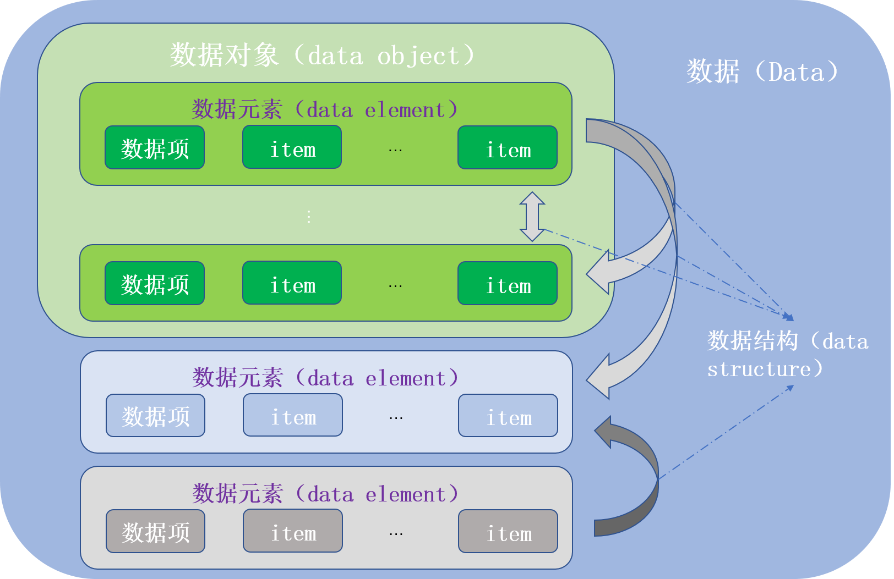
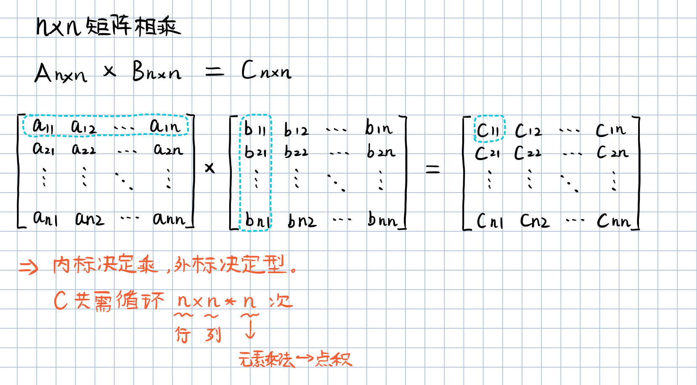

> 
>
> Contributor: datamonday
>
> Repo: https://github.com/datamonday/CPP-TechStack

# 1. Introduction

> update: 2021-5-6

如今，计算机的应用已经不再局限于科学计算，而更多地用于控制、管理及数据处理等非数值计算的处理工作。计算机加工的对象由纯数值发展到字符、表格和图像等各种具有一定结构的数据，这就要求必须分析待处理的对象特性以及各处理对象之间存在的关系。

计算机处理问题的步骤：

- 1）从具体问题抽象出一个数学模型；
- 2）设计一个解此数学模型的算法；
- 3）编写程序，测试，得出结果。

## 1.1 数据结构的基本概念

### 1.1.1 基本概念和术语

绘图工具：ppt、visio、mermaid、matplotlib、seaborn、plotly。



<center>直观理解1</center>


<center>直观理解2</center>

#### 1）数据（data）：

- 信息的载体；
- 对客观事物的符号表示；
- 所有能输入到计算机中并被计算机程序识别和处理的符号的总称；
- 计算机程序加工的原料。

#### 2）数据元素（data element）

- 数据的基本单位，通常作为一个整体进行考虑和处理；
- 一个数据元素可由若干个**数据项（data item）**组成；
- **数据项（data item）**是构成数据元素的不可分割最小单位。

#### 3）数据对象（data object）

- 性质相同的数据元素的集合；
- 是数据的一个子集。

#### 4）数据结构（data structure）

数据结构（data structure）是相互之间存在一种或多种特定关系的数据元素的集合。

- 在任何问题中，数据元素都不是孤立存在的，它们之间存在某种关系，这种数据元素相互之间的关系称为**结构（structure）**。
- 数据结构包括三方面的内容：**逻辑结构**，**存储结构**和**数据的运算**。
- 数据的逻辑结构和存储结构是密不可分的两个方面，一个算法的设计取决于所选定的逻辑结构，而算法的具体实现依赖于所采用的存储结构。

数据结构是一个二元组，其定义形式为：

$$Data \ Structure = (D, S)$$

其中，D是数据元素的有限集，S是D上关系（逻辑关系，逻辑结构）的有限集。

#### 5）数据类型（data type）

数据类型是**一个值的集合**和定义在此集合上的**一组操作**的总称。有以下三种：

- 1）原子类型：其值不可分解；
- 2）结构类型：其值可以再分解为若干成分（分量）；
- 3）抽象数据类型（Abstract Data Type）：指一个数学模型以及定义在该模型上的一组操作。抽象数据类型和数据类型实质上是一个概念。

### 1.1.2 数据结构的三要素

#### 1）数据的逻辑结构

数据的逻辑结构是指数据元素之间的逻辑关系，即从逻辑关系上描述数据。它与数据的存储无关，独立与计算机存在。数据的逻辑结构可以分为线性结构和非线性结构。


根据数据元素之间关系的不同特性，通常有下列4类基本结构：

- **集合**：结构中的数据元素之间仅存在“同属于同一个集合”的关系；
- **线性结构**：结构中的数据元素之间只存在**一对一**的关系；
- **树形结构**：结构中的数据元素之间只存在**一对多**的关系；
- **图状结构或网状结构**：结构中的数据元素之间只存在**多对多**的关系。


#### 2）数据的存储结构

存储结构（物理结构）是指数据结构在计算机中的表示（映像）。它是用计算机语言实现的逻辑结构。主要有以下四类：

| 存储结构         | 存储方式                                                     | 优点                                           | 缺点                                                         |
| ---------------- | ------------------------------------------------------------ | ---------------------------------------------- | ------------------------------------------------------------ |
| 顺序存储         | 把逻辑上相邻的元素存储在物理位置上也相邻的存储单元中，元素之间的关系由存储单元的邻接关系来体现。 | 可以实现随机存取，每个元素占用最小的存储空间。 | 只能使用相邻的一整块存储单元，因此产生较多的外部碎片。       |
| 链式存储         | 不要求逻辑上相邻的元素在物理位置上也相邻，借助指示元素存储地址的指针（pointer）来表示元素之间的逻辑关系。 | 不会出现碎片，能充分利用所有存储单元。         | 每个元素因存储指针而占用额外的存储空间。                     |
| 索引存储         | 在存储元素信息时，还建立附加的索引表。索引表中的每项称为索引项。其一般形式为：`(关键字，地址)`。 | 检索速度快                                     | 附加的索引表额外占用存储空间。增删数据需要修改索引表，耗时。 |
| 散列（哈希）存储 | 根据元素的关键字直接计算出该元素的存储地址。                 | 增删查改速度快                                 | 若散列函数不好，可能出现元素存储单元的冲突，而解决冲突会增加时间的空间开销。 |

#### 3）数据的运算

施加在数据上的运算包括运算的定义和实现。运算的定义是针对逻辑结构的，指出运算的功能；运算的实现是针对存储结构的，指出运算的具体操作步骤。

### 1.1.3 抽象数据类型（ADT）

**抽象数据类型（Abstract Data Type，ADT）**是指一个数学模型以及定义在此数学模型上的一组操作。仅取决于它的一组逻辑特性，而与其在计算及内部的表示和实现无关，即不论其内部结构如何变化，只要它的数学特性不变，都不影响外部的使用。

- 由用户定义，从问题抽象出数据类型（逻辑结构）；
- 定义在数据类型上的一组抽象运算（相关操作）；
- 不考虑计算机内的具体存储结构与预算的具体实现算法。

抽象数据类型可用三元组 $(D, S, P)$ 表示，其中：

- D：数据对象；
- S：D上的关系集；
- P：对D的基本操作集。

#### 抽象数据类型的形式定义

```c
ADT 抽象数据类型名{
    数据对象：<数据对象的定义>
    数据关系：<数据关系的定义>
    基本操作：<基本操作的定义>
} ADT 抽象数据类型名称
```

基本操作的定义格式：

```c
基本操作名(参数表)
    初始条件：<初始条件描述>
    操作结果：<操作结果描述>
```

两种参数：

- 赋值参数：只为操作提供输入值。
- 引用参数：以 `&` 打头，表示引用。

#### 抽象数据类型三元组的定义

```c
ADT Triplet{
    数据对象：D={e1,e2,e3|e1,e2,e3∈ElemSet(定义了关系运算的某个集合)}
    数据关系：R1={<e1,e2>,<e2,e3>}
    基本操作：
        InitTriplet(&t,v1,v2,v3)
        	操作结果：构造了三元组T,元素e1,e2和e3分别被赋以参数v1,v2和v3的值。
        DestroyTriplet(&T)
            操作结果：三元组T被销毁
        Get(T,i，&e)
        	初始条件：三元组T已存在，1<=i<=3
        	操作结果：用e返回T的第i元的值
		put(&T，i，e,)
			初始条件：三元组T已存在，1<=i<=3
			操作结果：改变T的第i元的值为e
        IsAscending(T)
        	初始条件：三元组T已存在
        	操作结果：如果T的3个元素按升序排列，则返回1，否则返回0
        IsDescending(T)
        	初始条件：三元组T已存在。
        	操作结果：如果T的3个元素按降序排列，则返回1，否则返回0.
        Max(T，&e)
        	初始条件：三元组T已存在
        	操作结果：用e返回T的三个元素中的最大值
        Min(T，&e)
        	初始条件：三元组T已存在
        	操作结果：用e返回T的三个元素中的最小值
}ADT Triplet
```

#### 抽象数据类型的实现

抽象数据类型可以通过固有的数据类型（如整型、实数型、字符型等）来表示和实现。即利用处理器中已存在的数据类型来说明新的结构，用已经实现的操作来组合新的操作。

### 1.1.4 易错点梳理

1. **顺序表、哈希表和单链表**是三种不同的数据结构，既描述逻辑结构，又描述存储结构和数据运算。**有序表**是指关键字**有序的线性表**，仅描述元素之间的逻辑结构，它既可以链式存储，又可以顺序存储，故属于逻辑结构。
2. **循环队列**：用顺序表表示的队列，是一种**数据结构**。
3. **栈**：是一种**抽象数据类型**，可采用顺序存储或链式存储，只表示**逻辑结构**。
4. 存储数据时，不仅要存数据元素的值，还要**存储数据元素之间的关系**。
5. **链式存储**中，各个不同节点的存储空间可以不连续，但节点内的存储单元地址必须连续。

1. **对于两种不同的数据结构，逻辑结构和物理结构一定不同吗？**

   可能完全相同，比如二叉树和二叉排序树，二叉排序树可以采用二叉树的逻辑表示和存储方式，前者通常用于表示层次关系，而后者通常用于排序和查找。

   二者虽然都有建立树、插入删除查找结点操作，但定义不同。以查找结点点为例，二叉树的时间复杂度为 $O(n)$，二叉排序树为 $O(log_2n)$。

2. **举例说明相同的逻辑结构，同一种运算在不同的存储方式下实现时，其运算效率不同。**

   例如，线性表既可以用顺序存储方式实现，又可以用链式存储方式实现。顺序存储平均要移动近一半的元素，时间复杂度为 $O(n)$，链式存储方式下，时间复杂度为 $O(1)$。

---

## 1.2 算法和算法分析

### 1.2.1 算法的重要特性

算法（algorithm）是对特定问题求解步骤的一种描述，是指令的有限序列，其中的每条指令表示一个或多个操作。

- 有穷性
- 确定性
- 可行性
- 输入
- 输出

### 1.2.2 算法的设计要求

#### 1）正确性（correctness）

- a.程序中**不含语法错误**；
- b.程序对于**几组输入数据**能够得出满足规格说明要求的结果；
- c.程序对于**精心选择的、典型的、苛刻的且带有刁难性的几组输入数据**能够得出满足要求的结果。（通常意义上衡量一个算法是否合格的标准）
- d.程序对于**一切合法的输入数据**都能得出满足要求的结果。

#### 2）可读性（readability）

- 可读性好，帮助人们理解。

#### 3）健壮性（robustness）

- 当输入数据非法时，算法也能适当地做出反应或进行处理，而不会产生莫名其妙的输出结果。

#### 4）高效性（efficiency）

- 运行速度快；
- 存储占用少。

---

### 1.2.3 算法效率的度量

#### 时间复杂度

- **频度 f(n)**：一个语句的频度是指该语句**在算法中被重复执行的次数 x**。
- **问题规模 T(n)**：算法中**所有语句的频度之和**。它是该算法问题规模 n 的函数，时间复杂度主要分析 T(n) 的数量级。算法中基本运算（最深层循环内的语句）的频度与T(n)同数量级，因此通常采用算法中基本运算的频度 f(n) 来分析算法的时间复杂度，记为 $T(n) = O(f(n))$。
- $O$ (order) ：其含义是 T(n) 的数量级。
- **时间复杂度**：若有某个辅助函数 f(n)，使得当 n 趋近于无穷大时，T(n)/f(n) 的极限值为不等于零的常数，则称  f(n) 是  T(n) 的同数量级函数。记作 $T(n) = O(f(n))$，称 $O(f(n))$ 为算法的渐进时间复杂度，简称时间复杂度。它表示随着n的增大，算法执行的时间的增长率和f(n)的增长率相同。（抓大放小）
- <font color=red>**时间复杂度是由嵌套最深层语句的频度决定的**。</font>

----

**分析一个程序的时间复杂度时，有以下两条规则**：

- **加法规则**

  $$T(n) = T(n_1) + T(n_2) = O(f(n)) + O(g(n)) = O(max(f(n), g(n)))$$

- **乘法规则**

  $$T(n) = T(n_1) \times T(n_2) = O(f(n)) \times O(g(n)) = O(f(n) \times g(n))$$

---

**常见的时间复杂度**：

$$O(1) < O(log_2n) < O(n) < O(nlog_2n) < O(n^2) < O(n^3) < O(2^n) < O(n!) < O(n^n) $$

---

**$n$ 越大，算法执行时间越长。对于不同的数据结构，$n$ 有不同的含义**：

- **排序**：n 为记录数；
- **矩阵**：n 为矩阵的阶数；
- **多项式**：n 为多项式的项数；
- **集合**：n 为元素个数；
- **树**：n 为树的节点个数；
- **图**：n为图的顶点数或边数。

---

#### 空间复杂度

空间复杂度 S(n) ：该算法所耗费的存储空间，它是问题规模 n 的函数，记为 $S(n) = O(g(n))$ 。

**算法原地工作**是指算法所需的**辅助空间为常量**，即 $O(1)$ 。

---

### 1.2.4 算法时间复杂度分析

时间复杂度计算步骤：

- 1）找到执行次数最多（频度最大）的语句；
- 2）表示成问题规模 n 的函数 f(n)；
- 3）计算函数的数量级。

关键是要找出执行次数 x 与 n 的关系，并表示成 n 的函数。

**[例1]** 两个 n × n 矩阵相乘的算法可描述为：



```c
// 行循环
for(i=1; i<=n; ++i){						// n+1 次
    // 列循环
    for(j=1; j<n; ++j){						// n(n+1) 次
        c[i][j] = 0;						// n*n 次
        // 点积运算：对应元素乘，再求和		  
        for(k=0; k<n; ++k){					// n*n*(n+1) 次
            c[i][j] += a[i][k] * b[k][i];	// n*n*n 次
        }
    }
}
```

**算法运行消耗的时间**：算法中**每条语句的频度之和**。所以上述算法的时间消耗 T(n)为：

$$T(n) = [n+1] + [n(n+1)] + [n*n] + [n*n*(n+1)] + [n*n*n] = 2n^3 + 3n^2 + 2n + 1$$

当 $n \rightarrow ∞$ 时，$T(n)/n^3 \rightarrow 2$，表示 $n$ 充分大时，$T(n)$ 与 $n^3$ 是同阶或者同数量级，$T(n)$ 可表示为：$T(n) = O(n^3)$。这就是算法的时间复杂度。

**算法的时间复杂度不仅依赖于问题的规模 n，也取决于待输入数据的性质**（如输入元素的初始状态）。一般总是考虑最坏时间复杂度，以保证算法的运行时间不会比它更长。

<font color=red>**时间复杂度是由嵌套最深层语句的频度决定的**。</font>上述n阶方阵相乘的算法中，最深层的语句为：`c[i][j] += a[i][k] * b[k][i];`，其时间复杂度可以按照下式计算：

$$T(n) = \sum^n_{i=1}\sum^n_{j=1}\sum^n_{k=1}1=n^3=O(n^3)$$

---

**[例2]**

```c
for(i=1;i<=n;++i)
    for(j=1;j<=i;++j)
        for(k=1;k<=j;++k)
        	x = x+1;
```

`x=x+1` 语句的频度计算：

$$\sum^n_{i=1}\sum^i_{j=1}\sum^j_{k=1}1 = \sum^n_{i=1}\sum^i_{j=1}j = \sum^n_{i=1} \frac{i(i+1)}{2}=\frac{1}{2}(\sum^n_{i=1}i^2 + \sum^n_{i=1} i) = \frac{1}{2}(\frac{n(n+1)(2n+1)}{6} + \frac{n(n+1)}{2}) = \frac{n(n+1)(n+2)}{6}$$

故 $T(n) = 0(n^3)$。

---

**[例3]**

```
i = 1;			 // 语句1
while (i <= n){
	i = i*2;     // 语句2
}
```

分析：

```c
第1次循环：i = 1 * 2 = 2^1;
第2次循环：i = 2 * 2 = 2^2;
第3次循环：i = 4 * 2 = 2^3;
...
第x次循环：i = 1 * 2 = 2^x;
```

设语句执行次数为 $x$ 次，由循环条件 $i <= n$，所以有 $2^x <= n$，所以有 $x <= log_2n$。即 $f(n) <= log_2n$，取最大值 $f(n) = log_2n$。

---

### 1.2.5 算法空间复杂度分析

将一维数组 a 中的 n 个数逆序存放到原数组中。

```c
// 算法1
for(i=0; i<n/2; ++i){
    t = a[i];          // 存储1个变量，空间复杂度 S(n) = O(1)
    a[i] = a[n-i+1];
    a[n-i+1] = t;
}
```

```c
// 算法2
for(i=0; i<n; ++i){
    b[i] = a[n-i-1];   // 存储n个变量，空间复杂度 S(n) = O(n)
}
for(i=0; i<n; ++i){
    a[i] = b[i];
}
```

---

### 1.2.6 易错点梳理

- 求整数 n (n>=0) 的阶乘的算法如下，其时间复杂度为：$O(n)$。

  ```c
  int fact(int n){
      if (n <= 1) {
          return 1;
      }
      else{
          return n * fact(n - 1);
      }
  }
  ```

  **每次递归调用时，fact() 的参数减1，递归的出口为fact(1)，一共执行n次递归调用fact()，所以时间复杂度为O(n)**。

- 相同规模n下，复杂度为O(n)算法在实际上总是优于复杂度为O(2^n)的算法；

- 同一个算法，实现语言的级别越高，执行效率越低。

- 求下列函数的时间复杂度：

  ```c
  int func(int n){
      int i=0, sum=0;
      while (sum < n){
          sum += ++i;
      }
      return i;
  }
  ```

  sum 与循环次数t满足关系式：sum = 0 + 1 + 2 + 3 + ··· + t  = (1+t) * t / 2 < n，可推知，时间复杂度为：$O(n^{1/2})$。

---

# 2. 线性表

> Update: 2021-5-10


数据的逻辑结构分类


线性表分类

 ## 2.1 线性表的定义和基本操作

线性表是具有相同数据类型的 n 个数据元素的有限序列，其中 n 为表长，当n=0时，线性表示一个空表。

线性表的特点：

- 表中的元素个数有限；
- 表中元素具有逻辑上的顺序性，表中元素有其先后次序；
- 表中数据元素的类型可以为简单类型，也可以为复杂类型；
- 表中元素的数据类型相同，即每个元素占有相同大小的存储空间；
- 除第一个元素外，每个元素有且仅有一个直接前驱；
- 除最后一个元素外，每个元素有且仅有一个直接后继；
- 表中元素具有抽象性，即仅讨论元素间的逻辑关系，而不考虑元素究竟表示什么内容。

---

## 2.2 线性表的顺序表示 (顺序表)

 用一组地址连续的存储单元依次存储线性表中的顺序元素，从而使得逻辑上相邻的两个元素在物理位置上也相邻（顺序表中的元素逻辑顺序与物理顺序相同）。即以元素在计算机内“物理位置相邻”来表示线性表中数据元素之间的逻辑关系。

$i$ 为元素 $a_i$ 在线性表中的位序。注意：线性表中元素的位序是从1开始的，而数组中元素的下标是从0开始的。

顺序表的优点：**任一元素都可以随机存取，即通过首地址和元素序号可以在时间 $O(1)$ 内找到指定的元素**。所以线性表的顺序存储结构是一种随机存取的**存储结构**。

- 顺序表的存储密度高，每个结点只存储数据元素。
- 顺序表逻辑上相邻的元素物理上也相邻，所以插入和删除操作需要移动大量的元素。


----

由于高级语言中的数组类型也具有随机存取的特性，因此，通常**用数组来描述数据结构中的顺序存储结构**。由于线性表的长度可变，且所需最大存储空间随问题不同而不同，则在C语言中可用**动态分配**的一维数组。注意：一维数组可以静态分配，也可以动态分配。

- 静态分配：数组的大小和空间已经固定，一旦空间占满，就会产生溢出，导致程序崩溃。
- 动态分配：存储数组的空间在程序执行过程中通过动态存储分配语句分配，一旦数据沾满空间，就另外开辟一块更大的存储空间，用以替换原来的存储空间，从而达到扩充存储数组空间的目的，不需要一次性地划分所有空间。

一维数组定义：

```c
类型说明符 数组名[常量表达式]
```

常量表达式中可以包含常量和符号常量，但不能包含变量。即C语言中不允许动态定义数组的大小。那该怎么办呢？—— 使用结构体，用一变量表示顺序表的长度属性。

假设线性表的元素类型为 ElemType，则线性表的顺序存储类型定义：

```c
#define MaxSize 50 			// 定义线性表的最大长度
typedef struct{
    ElemType data[MaxSize]; // 顺序表的元素(ElemType是泛指, 可以为int,char,float...)
    int length;				// 顺序表的当前长度
}SqList;					// 顺序表的类型定义
```

ElemType的构建方式举例：

```c
[1] typedef char ElemType;
[2] typedef int ElemType;
[3] typedef struct{
    
    }ElemType;
```

动态分配的线性表的顺序存储类型定义：

```c
#define InitSize 100		// 定义表的初始长度
typedef struct{
    ElemType *data;			// 指示动态分配数组的指针(存储空间的基地址)
    int MaxSize, length;	// 数组的最大容量和当前个数
}SqList
```

C语言的初始动态分配语句：

```
<malloc.h>
SqList L;
L.data = (ElemType*)malloc(sizeof(ElemType)*MaxSize);
```

- `malloc(m)函数`：开辟m字节长度的地址空间，并返回这段空间的首地址；
- `sizeof(x)运算`：计算变量x的长度，以字节为单位；
- `(ElemType*)`：强制类型转换，转换为指定类型的指针，因为SqList中的数组是以指针定义的；
- `free(p)函数`：释放指针p所指变量的存储空间，即彻底删除一个变量。

空间划分说明：假设malloc开辟了800个字节，如何划分由 ElemType的类型决定；如果为char类型，则800个字节划分为800个空间；如果为int或float类型，则划分为800/4=200空间，其他类型及自定义类型同理。

C++语言的初始动态分配语句：

```c++
new 类型名T (初值列表)
    功能：申请用于存放T类型对象的内存空间，并依初值列表赋以初值
    结果：
    	成功：T类型的指针，指向新分配的内存
    	失败：0（NULL）
```

```C++
delete 指针P
    功能：释放指针P指向的内存，P必须是new操作的返回值
```

C语言的一些语法：

```c
#include <iostream.h>
cin >> a >> b;	// 表示键盘输入到a和b
cout << a << endl << b << endl;	 // 表示输出a和b的值，endl表示换行
```

## 2.3 C语言的参数传递

1. 传值方式（不改变实参的值）

- 把实参的值传递给函数局部工作区响应的副本中，函数使用这个副本执行必要的功能。函数修改的是副本的值，实参的值不变。

  

2.传地址方式——指针变量作为参数（改变实参的值）


3.传地址方式——指针变量作为参数（不改变实参的值）


4.传地址方式——数组名作为参数（改变实参的值）

- 传递的是数组的首地址

- 对形参数组所做的任何改变都将反映到实参数组中。

  

5.传地址方式——引用类型作为参数（改变实参的值）


**a和m的地址相同，共用同一个空间，是同一个东西。b和n同理**。

---

引用类型作形参的三点说明：

- 传递引用给函数与传递至真的效果是一样的，形参变化实参也发生变化。
- 引用类型作为形参，在内存中没有产生实参的副本，它直接对实参操作；而一般变量作为形参，形参与实参就占用不同的存储单元，所以形参变量的值是实参变量的副本。因此，当参数传递的数据量较大时，用引用比用一般变量传递参数的时间和空间效率都好。
- 指针参数虽然也能达到与使用引用的效果，但在被调用函数中需要重复使用 `*指针变量名` 的形式进行运算，这很容易产生错误且程序的阅读性较差；另一方面，**在主调函数的调用点处，必须用变量的地址作为实参**。

---

## 2.4 顺序表定义的理解


 

## 2.5 顺序表的查找、插入和删除


 


---

## 2.6 线性表的链式存储（单链表）介绍


## 2.7单链表的表示和实现


---

## 2.8 单链表的基本操作


指针的类型由指针域指向的对象的类型决定，例如：

```c
int a = 5; // 定义整型变量a
int *p; // 定义指针p
p = &a; // 取地址运算符&，取出a的地址赋给p
```

### 定义单链表


也可以定义：`Lnode *p;` `*LinkList` 为指向Lnode结构体类型（有两个成员）的指针。


 


### 空的单链表

&L 为引用型变量


### 销毁单链表（删除全部结点）

p=L：即p指向L（将头结点的指针赋值给p），目的是把头结点一块删除


### 清空单链表（只保留头结点）

p=L->next：即p指向L的首元结点，因为是清空链表，是删除除头结点以外的所有节点，所以不需要操作头结点，这点与销毁链表不同，需要注意。

q指向需要清除节点p的下一个节点。


### 求单链表的表长


---

## 2.9 取单链表中第i个元素的内容


`*next` 为同样的指向LNode类型的指针。


status是类c语言的语法。

e需要返回，所以使用引用型变量 `&e`。


## 2.10 单链表的按值查找

### 返回数据的地址


加指针符号`*` 表示这个函数返回的类型是Lnode指针类型

### 返回数据的索引


---

## 2.11 单链表的插入（先连后再接前）

在第i个结点前插入值为e的新结点。


---

## 2.12 单链表的删除（双指针 p 和 q）

删除第i个结点。双指针 p 和 q


---

## 2.13 单链表的算法复杂度分析


## 2.14 单链表的建立

### 头插法


时间复杂度为O(n)。

---

### 尾插法


---


----

> 参考资料：
>
> 1. 严蔚敏《数据结构(C语言描述)》
> 2. 数据结构与算法基础：[bilibili](https://www.bilibili.com/video/BV1nJ411V7bd?p=5&spm_id_from=pageDriver)
> 3. 数据结构复习指导
> 4. 数据结构高分笔记

